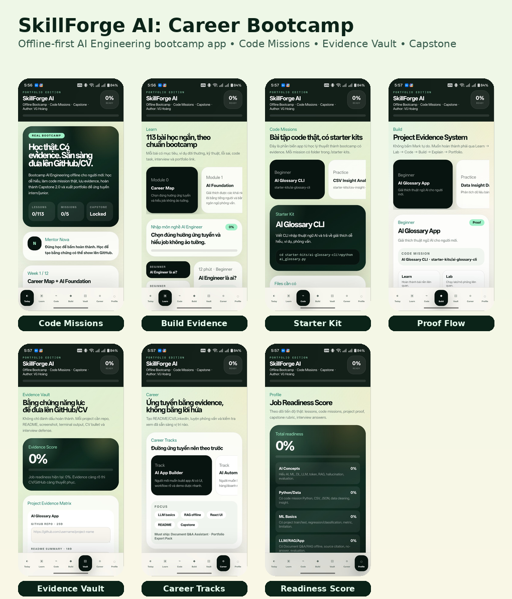
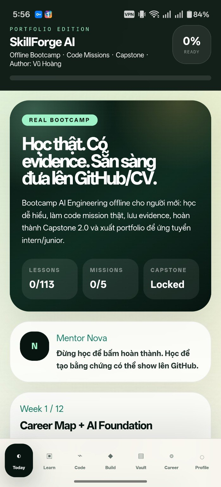
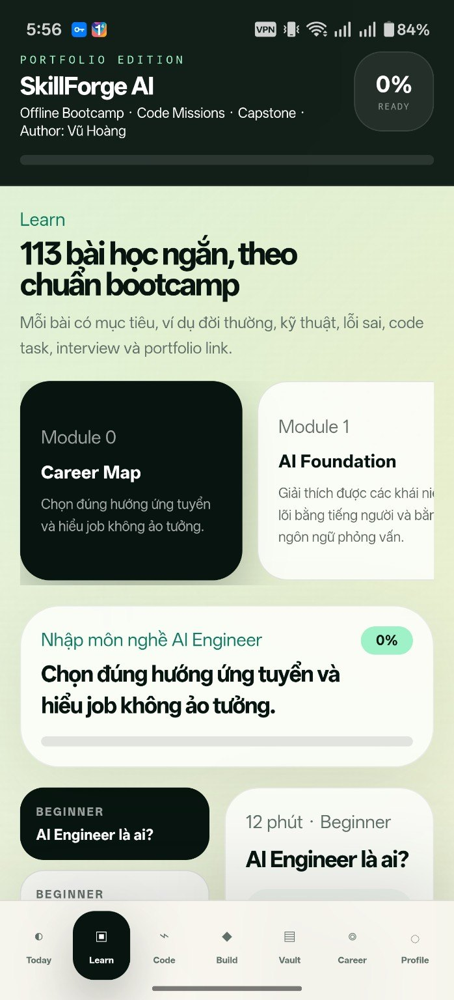
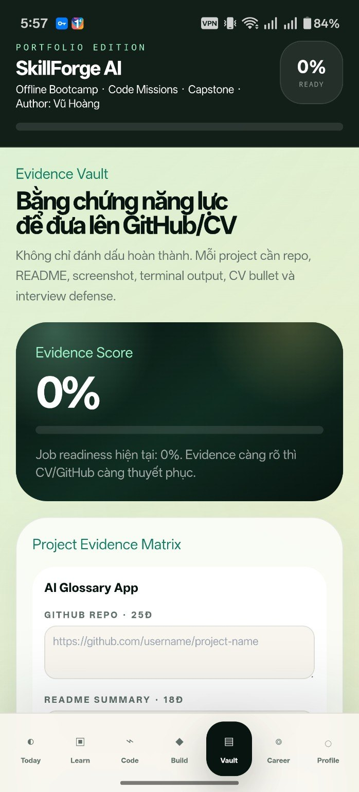
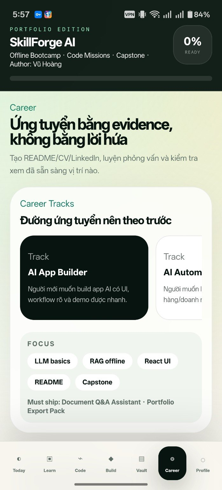

# SkillForge AI: Career Bootcamp


**Portfolio-ready offline AI Engineering bootcamp app for Vietnamese beginners.**

**Author:** Vũ Hoàng  
**Repository:** `skillforge-ai-bootcamp`  
**App name:** SkillForge AI  
**Build target:** Web + Android APK via Capacitor  
**Mode:** Offline-first, no backend, no login, no real AI API in MVP

---

## Preview



<p align="center">
  
  
  
  
</p>

---

## 1. Project Summary

SkillForge AI is a mobile-first career bootcamp app that helps Vietnamese beginners move from basic AI concepts to job-ready portfolio evidence.

The app is not a simple quiz app. It uses a stricter learning loop:

```text
Learn → Lab → Code Mission → Build Project → Save Evidence → Explain → Export Portfolio
```

The goal is realistic: help learners prepare for entry-level roles such as:

- AI Engineer Intern
- Junior AI App Builder
- AI Automation Assistant
- LLM Application Developer Intern
- Junior AI Solutions Builder

It does **not** claim that a beginner becomes a Senior AI Engineer by only reading lessons.

---

## 2. Why this project is portfolio-worthy

Most beginner AI apps stop at lessons and quizzes. SkillForge AI focuses on proof of skill:

- runnable Python code missions
- project evidence collection
- GitHub-ready README generation
- CV bullet generation
- interview defense prompts
- capstone evaluation reports
- realistic career positioning

This makes the project suitable for GitHub portfolio and CV because it demonstrates product thinking, learning-system design, mobile-first UI/UX, offline-first architecture and practical AI Engineering curriculum design.

---

## 3. Core Features

### Career Bootcamp System

- 100+ micro-lessons
- 12-week sprint roadmap
- placement test
- 4 career tracks
- skill tree
- spaced repetition
- weekly sprint review

### Code Missions

The app includes runnable starter kits in `/starter-kits`:

1. `ai-glossary-cli`
2. `csv-insight-analyzer`
3. `ml-predictor-demo`
4. `document-qa-offline`
5. `ai-automation-workflow`

Each mission is designed for beginners and produces evidence that can be added to GitHub.

### Evidence Vault

Learners can save:

- GitHub repo links
- README text
- terminal output
- screenshots/demo proof
- CV bullets
- interview answers
- project notes

### Capstone 2.0

**AI Career Capstone: Document Q&A Assistant**

A final project that simulates a RAG-style Document Q&A workflow offline:

```text
Local documents
→ keyword retrieval
→ grounded answer
→ source citation
→ no-answer behavior
→ evaluation test set
→ capstone report
```

### Career Tools

- portfolio export pack
- CV project description
- LinkedIn post template
- mock interview defense
- career reality check
- production-thinking labs
- AI safety and trust module

---

## 4. Tech Stack

| Layer | Technology |
|---|---|
| Frontend | React 19 + Vite |
| Styling | Tailwind CSS 3 |
| Storage | LocalStorage |
| Mobile wrapper | Capacitor Android |
| Code missions | Python starter kits |
| Backend | None |
| Auth | None |
| AI API | None in MVP |
| Online database | None |

---

## 5. Run locally

```bash
git clone https://github.com/Megatavn/skillforge-ai-bootcamp.git
cd skillforge-ai-bootcamp
npm ci
npm run dev
```

Open the forwarded Vite URL in Codespace or your browser.

---

## 6. Build web

```bash
npm run build
```

---

## 7. Build Android APK

```bash
npm run build
npm run cap:sync
cd android
./gradlew assembleDebug
```

APK output:

```text
android/app/build/outputs/apk/debug/app-debug.apk
```

> Note: Capacitor Android builds may require a compatible JDK and Android SDK in Codespace/local machine.

---

## 8. Test starter kits

```bash
python starter-kits/ai-glossary-cli/ai_glossary.py
python starter-kits/csv-insight-analyzer/analyzer.py
python starter-kits/ml-predictor-demo/train_model.py
python starter-kits/document-qa-offline/document_qa.py
python starter-kits/ai-automation-workflow/automation_workflow.py
```

---

## 9. Folder structure

```text
skillforge-ai-bootcamp/
├── .github/workflows/
├── android/
├── docs/screenshots/
├── src/
│   ├── App.jsx
│   ├── data/curriculum.js
│   ├── utils/generators.js
│   └── utils/storage.js
├── starter-kits/
│   ├── ai-glossary-cli/
│   ├── csv-insight-analyzer/
│   ├── ml-predictor-demo/
│   ├── document-qa-offline/
│   └── ai-automation-workflow/
├── README.md
├── CV_PROJECT_DESCRIPTION.md
├── GITHUB_UPLOAD_GUIDE.md
├── DESIGN_SYSTEM.md
├── REAL_BOOTCAMP_CURRICULUM.md
└── capacitor.config.json
```

---

## 10. Suggested GitHub repository description

```text
Offline-first AI Engineering career bootcamp app for Vietnamese beginners, featuring code missions, Evidence Vault, Capstone 2.0, portfolio export and interview defense.
```

Suggested topics:

```text
ai-engineering, react, vite, tailwindcss, capacitor, android, offline-first, localstorage, education, portfolio, vietnamese, career-bootcamp, rag
```

---

## 11. Suggested CV bullets

```text
Built SkillForge AI, an offline-first AI Engineering career bootcamp app for Vietnamese beginners, using React, Vite, Tailwind CSS, LocalStorage and Capacitor.
```

```text
Designed a job-readiness learning system with micro-lessons, code missions, Evidence Vault, Capstone 2.0, portfolio export, career tracks and interview defense workflows.
```

```text
Implemented runnable Python starter kits and an offline Document Q&A Assistant capstone that simulates RAG with local documents, keyword retrieval, source citation, no-answer behavior and evaluation reports.
```

---

## 12. What I learned

- Designed an offline-first learning product for beginner AI Engineering learners.
- Built a structured career-readiness system with lessons, code missions, evidence tracking and capstone evaluation.
- Implemented local persistence with LocalStorage.
- Packaged a React/Vite web app into Android APK using Capacitor.
- Created Python starter kits to connect learning content with hands-on project evidence.

---

## 13. Limitations

This MVP is intentionally offline-first:

- No real AI API in the MVP.
- No backend, login or cloud sync.
- Capstone simulates RAG with keyword retrieval rather than embeddings/vector database.
- Production ML/MLOps concepts are represented as curriculum and learning labs, not full production infrastructure.

---

## 14. Roadmap

- [ ] Add optional AI tutor mode with user-provided API key
- [ ] Add embedding-based RAG mode
- [ ] Add GitHub Pages / Netlify live demo
- [ ] Add more demo video/GIF previews
- [ ] Add project submission review workflow
- [ ] Add optional cloud sync and account system

---

## 15. License

MIT License.
